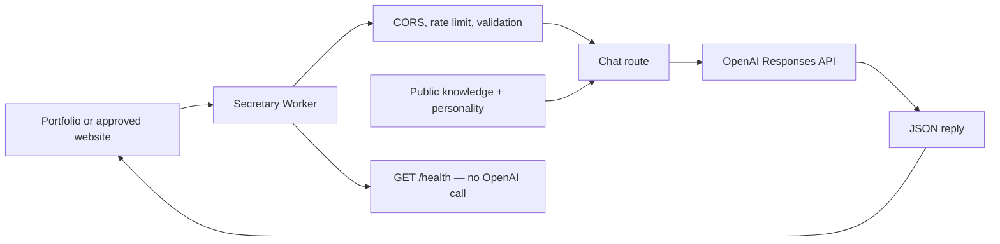

# Secretary

**The API behind “Ask Danilo’s Secretary”.**

A small, standalone Cloudflare Worker that answers questions about Danilo’s work and portfolio. Built for `danilostoletovic.com`, consumable by any approved website. No frontend, database, conversation storage, or unnecessary filing cabinets.

Each chat request combines a separately maintained personality and public knowledge file with the visitor’s message, calls OpenAI, and returns a plain-text reply in JSON. Requests are independent: there is no conversation history or ability to send messages or book meetings.

## Architecture



TypeScript in strict mode, Cloudflare Workers, Bun, Wrangler, and Zod. Native `fetch` calls the OpenAI Responses API; Zod is the only runtime dependency. The default model is [`gpt-4.1-mini`](https://developers.openai.com/api/docs/models/gpt-4.1-mini), an inexpensive model with low latency suitable for short portfolio questions. Change `OPENAI_MODEL` to another text-capable Responses API model as needed; verify its output-token requirements and behavior before deploying.

## API

### `GET /health`

Returns HTTP 200 without calling OpenAI or requiring an API key. This is a liveness check, not an upstream readiness check.

```json
{ "status": "ok", "service": "secretary" }
```

### `POST /chat`

Requires `Content-Type: application/json`. Supply exactly one `message` string, containing 1–2,000 characters after trimming (JavaScript UTF-16 length). The entire UTF-8 body is limited to 16 KiB, enforced while reading even without a Content-Length header. Compressed request bodies and extra JSON fields are rejected.

```sh
curl http://localhost:8787/chat \
  -H 'Content-Type: application/json' \
  -d '{"message":"Can Danilo build me a website?"}'
```

Illustrative response (wording varies; the initial knowledge intentionally does not assert services):

```json
{
  "reply": "I don’t have Danilo’s confirmed service list yet. You can explore his portfolio at https://danilostoletovic.com."
}
```

Errors have a consistent shape:

```json
{ "error": { "code": "invalid_request", "message": "Provide only a message containing 1–2000 characters." } }
```

| Status | Meaning |
| --- | --- |
| 200 | Health or successful reply |
| 204 | Valid CORS preflight |
| 400 | Invalid JSON or message |
| 403 | Origin or preflight not allowed |
| 404 | Unknown endpoint |
| 405 | Wrong method; includes `Allow` |
| 413 | Body exceeds 16 KiB |
| 415 | Unsupported content type or encoding |
| 429 | Local rate limit; includes `Retry-After: 60` |
| 500 | Sanitized unexpected internal failure |
| 502 | OpenAI request failed or response was empty, invalid, or incomplete |
| 503 | Invalid/missing configuration, unavailable limiter, or upstream overload/quota limit |
| 504 | OpenAI timeout |

## Local development

Install [Bun](https://bun.sh/) and a current Node.js LTS version supported by Wrangler (Node 22 or newer). From this directory:

```sh
bun install
cp .dev.vars.example .dev.vars
```

In PowerShell, use `Copy-Item .dev.vars.example .dev.vars` instead. Edit `.dev.vars` and replace the placeholder with your own OpenAI API key, then run:

```sh
bun run dev
```

Wrangler serves at `http://localhost:8787` and emulates the rate-limit binding locally. `/health` works without a key; `/chat` needs a real key and sends real, billable OpenAI requests. Local development does not use a fake model. The automated tests mock OpenAI and need no credentials.

```sh
bun run typecheck
bun test
bun run check
bun run deploy:check
curl http://localhost:8787/health
```

The lockfile is committed for repeatable installs; use `bun install --frozen-lockfile` in CI. Tests cover routing, CORS, body limits, input and configuration validation, rate-limit failures, upstream request construction, failure responses, refusals, and timeouts.

## Configuration

Public production settings live in `wrangler.jsonc`. `.dev.vars` overrides variables during local development only.

| Variable | Default | Purpose |
| --- | --- | --- |
| `OPENAI_API_KEY` | Required secret | OpenAI credential; never put it in Wrangler vars or browser code |
| `OPENAI_MODEL` | `gpt-4.1-mini` | Text-capable Responses API model |
| `ALLOWED_ORIGINS` | `https://danilostoletovic.com,https://www.danilostoletovic.com` | Comma-separated exact origins, including scheme and any port; no paths, trailing slash, or wildcard |
| `OPENAI_TIMEOUT_MS` | `20000` | Upstream timeout, integer 100–60,000 milliseconds |
| `OPENAI_MAX_OUTPUT_TOKENS` | `400` | Output budget, integer 16–2,000; incomplete replies return 502 |

The body and message limits are constants in `src/lib/body.ts`. The native `CHAT_RATE_LIMITER` binding allows 10 attempts per IP per 60 seconds, including malformed chat requests. Configure its `simple.limit`, `simple.period` (10 or 60 seconds), and `namespace_id` in `wrangler.jsonc`. Choose a namespace ID unique within your Cloudflare account unless sharing counters is intentional. A missing or failing binding returns 503 instead of permitting unlimited paid calls.

## Deploy to Cloudflare

1. Update the public knowledge and confirm the allowed origins and rate-limit namespace.
2. Authenticate and validate the bundle:

   ```sh
   bunx wrangler login
   bun run check
   bun run deploy:check
   ```

3. Deploy the Worker, then set its encrypted secret interactively:

   ```sh
   bun run deploy
   bunx wrangler secret put OPENAI_API_KEY
   ```

   Paste the key into Wrangler’s prompt. Do not place the key in a shell command, Git, or `wrangler.jsonc`. Until the secret exists, `/chat` safely returns 503. Updating the secret uses the same command. Local `.dev.vars` is not uploaded by deployment.

4. Verify the `https://secretary.<your-subdomain>.workers.dev/health` URL printed by Wrangler. Test `/chat` with a real key, then configure your website to use that base URL. You can attach a custom domain in Cloudflare later; it is not required to deploy.

No deployment or Cloudflare account changes happen when running the test suite or `deploy:check`.

## Consume from another website

Add that website’s exact origin to `ALLOWED_ORIGINS` and redeploy. For localhost, update `.dev.vars` instead. Browsers perform the supported OPTIONS preflight automatically.

```js
const response = await fetch('https://secretary.<your-subdomain>.workers.dev/chat', {
  method: 'POST',
  headers: { 'Content-Type': 'application/json' },
  body: JSON.stringify({ message: 'What does Danilo work on?' }),
});
const data = await response.json();
if (!response.ok) throw new Error(data.error?.message ?? 'Secretary is unavailable.');
answerElement.textContent = data.reply;
```

Render replies as text (`textContent`), not raw HTML. Never send an OpenAI key from the browser. Direct server-to-server clients and curl may omit Origin; requests with an unapproved Origin are rejected.

## Editing the secretary

- `src/config/personality.ts`: tone, scope, honesty, and behavior instructions.
- `src/knowledge/danilo.ts`: about, services, technologies, projects, contact, and FAQs. Replace TODOs and nulls with approved public information. Empty entries mean unknown. The initial knowledge contains only Danilo’s supplied name and portfolio URL.

Knowledge is serialized into the instructions at build time. Redeploy after changes. Do not put private information or secrets in either file. There is no RAG, vector database, or model tool access.

## Project structure

```text
src/
  index.ts                 Routing, CORS, and safe error boundary
  routes/chat.ts           Validation and rate limiting
  lib/body.ts              Bounded JSON body reader
  lib/http.ts              JSON errors and security headers
  lib/openai.ts            Responses API call, timeout, and reply parsing
  config/env.ts            Environment validation
  config/personality.ts    Secretary instructions
  knowledge/danilo.ts      Editable public knowledge
tests/api.test.ts          Automated tests with mocked OpenAI
.dev.vars.example          Local secret/config example
wrangler.jsonc             Worker configuration and rate-limit binding
```

## Security and operations

- CORS restricts browser access; it is not authentication and cannot prevent direct HTTP callers from using a public API. No complicated login system is required.
- Cloudflare’s [native rate limits](https://developers.cloudflare.com/workers/runtime-apis/bindings/rate-limit/) are approximate and local to a Cloudflare location, not a global spending cap. IP-based limits suit this anonymous API but can affect visitors sharing a network and can be bypassed by distributed traffic. Missing IPs share one conservative bucket. Only Cloudflare’s ingress `CF-Connecting-IP` header is used, not client-controlled forwarding headers.
- Review OpenAI usage and project budget alerts before public launch. For sustained abuse, add Cloudflare WAF protections or a verified challenge. The built-in limiter does not guarantee a fixed bill.
- Requests have bounded size and output tokens, a timeout, and no automatic retries. Security headers and `Cache-Control: no-store` apply to every response. Production Workers endpoints use HTTPS.
- The Worker stores no chats. It sends messages and public knowledge to OpenAI with `store: false`; this does not override OpenAI’s applicable retention policies. Avoid sending sensitive information and disclose the integration in your website’s privacy information.
- Error logs contain only a status, event, and safe error code. No message content, API keys, raw provider errors, or stack traces are logged or returned by this application. Configure Cloudflare observability separately if needed.
- Prompt instructions discourage invented facts and prompt injection, but model replies still need evaluation before launch. The model has no tools or authority to act on Danilo’s behalf.
- `.dev.vars`, `.env` variants, dependency folders, and build output are ignored by Git. Commit `bun.lock`; never commit real credentials.

## License

MIT — see [LICENSE](LICENSE).

Copyright (c) 2026 Danilo Stoletović.
