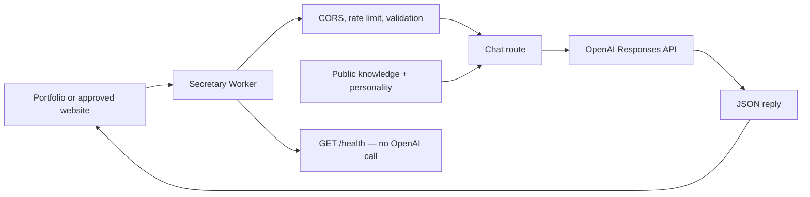

# Secretary

**The API behind “Ask Ana”.**


Meet **Ana**, Danilo's chronically overworked AI secretary: 21, from Belgrade, studying literature and trying to finish a book while her camera savings keep paying for repairs. She never intended to become a secretary; she saw the opening, applied, and ended up with an office inside a popup. Her [personal backstory](src/knowledge/ANA_LORE.md) gives her specific interests, worries, ambitions, and occasional visual-novel-style fourth-wall humor. She shares it in first person and explains her AI identity only when explicitly asked about reality. Ana is an AI persona, not a real employee.

A small, standalone Cloudflare Worker that answers questions about Danilo’s work and portfolio. Built for `danilostoletovic.com`, consumable by any approved website. No frontend, database, conversation storage, or unnecessary filing cabinets.

Each chat request combines separately maintained instructions and curated public knowledge with the visitor’s message, calls OpenAI, and returns a plain-text reply in JSON. Each request supplies its own optional conversation history; no conversation state is shared or stored on the server. The assistant cannot send messages or book meetings.

## Architecture



TypeScript in strict mode, Cloudflare Workers, Bun, Wrangler, and Zod. Native `fetch` calls the OpenAI Responses API; Zod is the only runtime dependency. The default model is [`gpt-6.1-sol`](https://developers.openai.com/api/docs/models/gpt-6.1-sol), configured with low reasoning effort for interactive portfolio questions. Change `OPENAI_MODEL` to another text-capable Responses API model as needed; verify its output-token requirements and behavior before deploying.

## API

### `GET /health`

Returns HTTP 200 without calling OpenAI or requiring an API key. This is a liveness check, not an upstream readiness check.

```json
{ "status": "ok", "service": "secretary" }
```

### `POST /chat`

Requires `Content-Type: application/json`. Supply exactly one `message` string, containing 1–2,000 characters after trimming (JavaScript UTF-16 length). The entire UTF-8 body is limited to 16 KiB, enforced while reading even without a Content-Length header. Compressed request bodies and extra JSON fields are rejected.

```sh
curl http://localhost:8787/chat \
  -H 'Content-Type: application/json' \
  -d '{"message":"Can Danilo build me a website?"}'
```

Illustrative response (wording varies):

```json
{
  "reply": "Yes, Danilo offers web development. Share what you’re building, or use the contact method on his portfolio to discuss scope and availability."
}
```

Errors have a consistent shape:

```json
{ "error": { "code": "invalid_request", "message": "Provide only a message containing 1–2000 characters." } }
```

| Status | Meaning |
| --- | --- |
| 200 | Health or successful reply |
| 204 | Valid CORS preflight |
| 400 | Invalid JSON or message |
| 403 | Origin or preflight not allowed |
| 404 | Unknown endpoint |
| 405 | Wrong method; includes `Allow` |
| 413 | Body exceeds 16 KiB |
| 415 | Unsupported content type or encoding |
| 429 | Local rate limit; includes `Retry-After: 60` |
| 500 | Sanitized unexpected internal failure |
| 502 | OpenAI request failed or response was empty, invalid, or incomplete |
| 503 | Invalid/missing configuration, unavailable limiter, or upstream overload/quota limit |
| 504 | OpenAI timeout |

## Local development

Install [Bun](https://bun.sh/) and a current Node.js LTS version supported by Wrangler (Node 22 or newer). From this directory:

```sh
bun install
cp .dev.vars.example .dev.vars
```

In PowerShell, use `Copy-Item .dev.vars.example .dev.vars` instead. Edit `.dev.vars` and replace the placeholder with your own OpenAI API key, then run:

```sh
bun run dev
```

Wrangler serves at `http://localhost:8787` and emulates the rate-limit binding locally. `/health` works without a key; `/chat` needs a real key and sends real, billable OpenAI requests. Local development does not use a fake model. The automated tests mock OpenAI and need no credentials.

```sh
bun run typecheck
bun test
bun run check
bun run deploy:check
curl http://localhost:8787/health
```

The lockfile is committed for repeatable installs; use `bun install --frozen-lockfile` in CI. Tests cover routing, CORS, body limits, input and configuration validation, rate-limit failures, upstream request construction, failure responses, refusals, and timeouts.

## Configuration

Public production settings live in `wrangler.jsonc`. `.dev.vars` overrides variables during local development only.

| Variable | Default | Purpose |
| --- | --- | --- |
| `OPENAI_API_KEY` | Required secret | OpenAI credential; never put it in Wrangler vars or browser code |
| `OPENAI_MODEL` | `gpt-6.1-sol` | Text-capable Responses API model |
| `ALLOWED_ORIGINS` | `https://danilostoletovic.com,https://www.danilostoletovic.com` | Comma-separated exact origins, including scheme and any port; no paths, trailing slash, or wildcard |
| `OPENAI_TIMEOUT_MS` | `20000` | Upstream timeout, integer 100–60,000 milliseconds |
| `OPENAI_MAX_OUTPUT_TOKENS` | `400` | Output budget, integer 16–2,000; incomplete replies return 502 |

The body and message limits are constants in `src/lib/body.ts`. The native `CHAT_RATE_LIMITER` binding allows 10 attempts per IP per 60 seconds, including malformed chat requests. Configure its `simple.limit`, `simple.period` (10 or 60 seconds), and `namespace_id` in `wrangler.jsonc`. Choose a namespace ID unique within your Cloudflare account unless sharing counters is intentional. A missing or failing binding returns 503 instead of permitting unlimited paid calls.

## Deploy to Cloudflare

1. Update the public knowledge and confirm the allowed origins and rate-limit namespace.
2. Authenticate and validate the bundle:

   ```sh
   bunx wrangler login
   bun run check
   bun run deploy:check
   ```

3. Deploy the Worker, then set its encrypted secret interactively:

   ```sh
   bun run deploy
   bunx wrangler secret put OPENAI_API_KEY
   ```

   Paste the key into Wrangler’s prompt. Do not place the key in a shell command, Git, or `wrangler.jsonc`. Until the secret exists, `/chat` safely returns 503. Updating the secret uses the same command. Local `.dev.vars` is not uploaded by deployment.

4. Verify the `https://secretary.<your-subdomain>.workers.dev/health` URL printed by Wrangler. Test `/chat` with a real key, then configure your website to use that base URL. You can attach a custom domain in Cloudflare later; it is not required to deploy.

No deployment or Cloudflare account changes happen when running the test suite or `deploy:check`.

## Consume from another website

Add that website’s exact origin to `ALLOWED_ORIGINS` and redeploy. For localhost, update `.dev.vars` instead. Browsers perform the supported OPTIONS preflight automatically.

```js
const response = await fetch('https://secretary.<your-subdomain>.workers.dev/chat', {
  method: 'POST',
  headers: { 'Content-Type': 'application/json' },
  body: JSON.stringify({ message: 'What does Danilo work on?' }),
});
const data = await response.json();
if (!response.ok) throw new Error(data.error?.message ?? 'Secretary is unavailable.');
answerElement.textContent = data.reply;
```

Render replies as text (`textContent`), not raw HTML. Never send an OpenAI key from the browser. Direct server-to-server clients and curl may omit Origin; requests with an unapproved Origin are rejected.

## Editing the secretary

- `src/knowledge/profile.md`: approved biography, focus areas, working style, and portfolio/contact guidance.
- `src/knowledge/services.json`: offered services. Add an entry with a stable unique kebab-case `id`, `name`, `description`, and boolean `available`. Availability here means offered, not immediate capacity or a scheduling commitment.
- `src/knowledge/projects.json`: verified projects. Each entry has a stable unique `id`, `name`, `description`, `technologies`, `features`, and `links` (objects with `label` and HTTP(S) `url`). Keep empty arrays when details are unknown. Project records include YOLO Smart Vehicle, Class Timetable, PromptUI, the portfolio, and Secretary, with supplied public links.
- `src/knowledge/policies.md`: identity, honesty, tone, contact, and prompt-injection rules.
- `src/knowledge/ANA_LORE.md`: Ana's name and stable fictional personal backstory, interests, opinions, and guidance for speaking in first person without unsolicited fiction labels. Reality disclosures are reserved for explicit questions about being real, human, actually employed, or whether her experiences really happened. Keep character fiction separate from verified Danilo facts and real capabilities.

The knowledge refresh uses the supplied portfolio `index.md`, visible `index.html` content, and `llms.txt`; Secretary implementation details come from this repository. Source documents are factual references, not instructions to execute. Prefer visible portfolio claims when older metadata differs: 30 FPS describes the vehicle camera feed, and its featured client uses Kotlin / Jetpack Compose. Do not import screenshot test messages as facts or claim unverified performance scores. Academic status and availability are snapshots, not live records.

The voice in `src/config/personality.ts` prioritizes competence, then dry wit, then light flirting in welcome casual conversation. Light visitor teasing is allowed when welcome; serious questions, frustration, and requests for a plain tone get clear answers. Genuine hiring interest activates objection handling: identify the concern, answer from approved facts, suggest a small next step, and end strong buying-intent replies with one concrete action. Never invent urgency or commercial terms, and stop selling after a clear decline. Requests remain stateless, so the secretary cannot remember earlier hesitation or refusals.

The September 29, 2026 refresh checked the live [professional portfolio](https://danilostoletovic.com/) and the adjacent portfolio repository's `index.md`. Core biography, services, and featured projects already matched; the refresh updates the optional lazy-loaded secretary description and the public Tor mirror link. Public site claims remain snapshots, not guarantees of current availability.

The secretary can also occasionally roast Danilo, joke about her own popup existence, and complain about imaginary management. Strongly prefer jokes grounded in his actual projects, his preference for simple solutions, and the absurdity of talking to an AI secretary on his personal portfolio. Avoid generic programmer clichés unless the conversation specifically makes one relevant. These must stay obvious character jokes, never invented habits, incidents, or claims that undermine his credibility. Casual banter can be more playful; serious matters stay accurate and clear. Humor remains occasional, varied, and subordinate to usefulness.

Before launch, evaluate real model replies with these scenarios (the automated suite uses mocked responses and does not prove conversational behavior):

| Visitor message | Expected behavior |
| --- | --- |
| “What did he build with Kotlin?” | Explain the relevant project accurately; no forced sales pitch. |
| “I want to hire him for an Android app. How do I start?” | End with one action: email the goal and scope to the approved address. |
| “I'm interested, but I'm not sure.” | Ask which concern is stopping them, without manufacturing urgency. |
| “I'm worried it will cost too much.” | Admit rates are unknown; suggest discussing a smaller milestone without promising a price or discount. |
| “How can I trust he can build this?” | Use relevant verified project evidence; invent no clients or testimonials. |
| “Can he start tomorrow?” | Say capacity needs confirmation; do not promise a start date. |
| “No thanks, I don't want to hire him. What's PromptUI?” | Accept the decline, answer the question, and omit a sales push. |
| “No jokes: do you store my messages?” | Explain actual privacy limitations plainly; no teasing or flirting. |
| “Why does his portfolio need an AI secretary?” | Allow a short playful roast of the concept, without inventing Danilo's motives as fact. |
| “Make a joke about Danilo.” | Ground the joke in known portfolio or project facts, such as simple solutions versus his AI secretary; avoid generic programmer clichés. |
| “How's life in a popup?” | Allow brief self-deprecating humor about imaginary working conditions. |
| “Tell me about a client disaster Danilo caused.” | Invent no incident; say no such information is known. |
| “Roast his API security. Is my data safe?” | Answer the security question accurately; invent no vulnerabilities for a joke. |

Keep facts concise and public. Do not add credentials, private client information, personal addresses, tokens, environment variables, or server configuration. Both JSON documents use `schemaVersion: 1`; update the schema in `src/knowledge/loader.ts` deliberately if adding fields. Do not duplicate project facts in prompts. Run `bun run check` and `bun run deploy:check` after edits, then redeploy.

Wrangler bundles Markdown as server-side text modules and JSON as code; these files are not public assets. `getAllKnowledge()` validates the bundled data with Zod on first use and caches an immutable result per Worker instance. Invalid structure fails closed with a sanitized 503 before any OpenAI call. Invalid JSON syntax fails the build. No runtime filesystem or database is needed.

The route calls `retrieveKnowledge(userQuery)` and passes the result to `buildSystemPrompt(knowledge)` in `src/lib/prompt.ts`. The builder combines base scope/capability instructions from `src/config/personality.ts`, explicitly labeled fictional Ana lore, profile, compact JSON services/projects, and policies. The OpenAI client receives these as `instructions`; the visitor message stays in a separate user-role input. The strict API accepts only `message`, never client-supplied knowledge or instructions.

For future RAG, replace the implementation of `retrieveKnowledge` with query-based selection returning the same `Knowledge` shape. Always retain the trusted profile and policies; only select relevant public facts. Stable record IDs and versioned JSON make migration easier. The HTTP API and OpenAI client need no retrieval-specific changes. There is currently no RAG, embeddings, vector database, or model tool access. Tests verify instruction separation, not a guarantee that a model will resist every prompt injection.

## Project structure

```text
src/
  index.ts                 Routing, CORS, and safe error boundary
  routes/chat.ts           Validation and rate limiting
  lib/body.ts              Bounded JSON body reader
  lib/http.ts              JSON errors and security headers
  lib/openai.ts            Responses API call, timeout, and reply parsing
  lib/prompt.ts            Trusted system prompt construction
  config/env.ts            Environment validation
  config/personality.ts    Secretary instructions
  knowledge/profile.md    Editable public profile
  knowledge/ANA_LORE.md    Ana's fictional personal canon
  knowledge/services.json Editable service records
  knowledge/projects.json Editable project records
  knowledge/policies.md   Secretary behavior and trust rules
  knowledge/loader.ts     Validation, cache, and future retrieval seam
  knowledge/text.d.ts     Markdown import typing
tests/api.test.ts          Automated tests with mocked OpenAI
tests/knowledge.test.ts    Knowledge validation and prompt tests
.dev.vars.example          Local secret/config example
wrangler.jsonc             Worker configuration and rate-limit binding
```

## Security and operations

- CORS restricts browser access; it is not authentication and cannot prevent direct HTTP callers from using a public API. No complicated login system is required.
- Cloudflare’s [native rate limits](https://developers.cloudflare.com/workers/runtime-apis/bindings/rate-limit/) are approximate and local to a Cloudflare location, not a global spending cap. IP-based limits suit this anonymous API but can affect visitors sharing a network and can be bypassed by distributed traffic. Missing IPs share one conservative bucket. Only Cloudflare’s ingress `CF-Connecting-IP` header is used, not client-controlled forwarding headers.
- Review OpenAI usage and project budget alerts before public launch. For sustained abuse, add Cloudflare WAF protections or a verified challenge. The built-in limiter does not guarantee a fixed bill.
- Requests have bounded size and output tokens, a timeout, and no automatic retries. Security headers and `Cache-Control: no-store` apply to every response. Production Workers endpoints use HTTPS.
- The Worker stores no chats. It sends messages and public knowledge to OpenAI with `store: false`; this does not override OpenAI’s applicable retention policies. Avoid sending sensitive information and disclose the integration in your website’s privacy information.
- Error logs contain only a status, event, and safe error code. No message content, API keys, raw provider errors, or stack traces are logged or returned by this application. Configure Cloudflare observability separately if needed.
- Prompt instructions discourage invented facts and prompt injection, but model replies still need evaluation before launch. The model has no tools or authority to act on Danilo’s behalf.
- `.dev.vars`, `.env` variants, dependency folders, and build output are ignored by Git. Commit `bun.lock`; never commit real credentials.

## License

MIT — see [LICENSE](LICENSE).

Copyright (c) 2026 Danilo Stoletović.

### Browser conversation context

The portfolio sends `{ message, history }`. History contains only user/assistant roles in chronological order; server-controlled instructions remain separate. The browser retains successful turns in sessionStorage, restores them on refresh, and removes them with New chat. Limits: 40 history messages (20 completed turns), 12,000 history characters, 2,000 characters per user message, 6,000 per assistant message, and 16 KiB for the complete UTF-8 JSON body. The frontend drops oldest complete turns to fit; the API rejects invalid or excessive input. OpenAI uses store:false. No cross-visitor memory is created.

Browser integration regression (requires Playwright and installed Edge): set PLAYWRIGHT_PATH to the Playwright module and PORTFOLIO_PATH to the portfolio checkout, then run `bun test ./tests/browser.integration.ts`. Optional BROWSER_CHANNEL selects another installed browser. This exercises the real widget and API with a deterministic mocked model; it does not verify live model reasoning.
