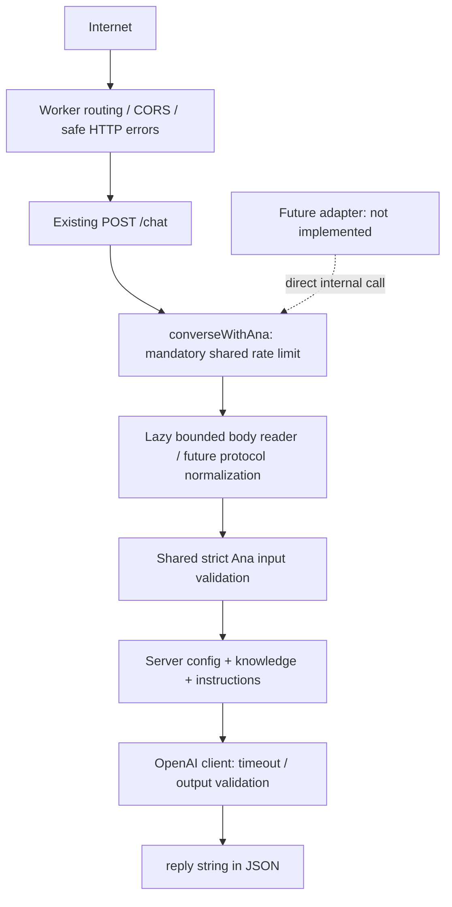

# Ana backend audit and future adapter boundary

Audit date: 2026-10-06. Scope: all production source, bundled knowledge/personality, configuration, README, tests and the adjacent portfolio chat client (read-only). No live account configuration, production traffic, secrets or model replies were inspected. No A2A implementation, Agent Card or deployment was created.

## Outcome and current architecture

A minimal extraction was necessary: the prompt builder, knowledge loader and OpenAI client were already separate, but the validated/rate-limited conversation operation was embedded in the HTTP route. `src/core/ana.ts` now provides that operation. `/chat` is a thin HTTP adapter. There is still one prompt builder, one immutable knowledge bundle and one model integration. Personality, knowledge, model, public schemas and response wording instructions are unchanged.



## Public interfaces and state

- `GET /health`: `{ "status": "ok", "service": "secretary" }`; liveness only, no model or limiter/config readiness test.
- `POST /chat`: strict `{ message: string, history?: Array<{ role: "user" | "assistant", content: string }> }`; returns `{ reply: string }`, never the prompt, model configuration or raw provider response. This is both the website endpoint and the public machine-readable API; there is no separate API implementation.
- `OPTIONS /health` and `OPTIONS /chat`: validated browser preflight, 204. Unknown paths: 404; wrong method: 405 with Allow. No A2A, discovery, tools, OpenAPI endpoint, task endpoint or streaming endpoint exists.
- Errors: `{ error: { code, message } }`; statuses 400/403/404/405/413/415/429/500/502/503/504. Local 429 includes Retry-After: 60.
- Backend is stateless: no cookies, session IDs, stored transcripts, database or cross-client memory. Every call may omit history. Caller supplies chronological history; the server validates roles/limits but does not require alternating turns or authenticate assistant text. Treat all supplied history as untrusted conversation data.
- Portfolio `js/secretary.js` owns browser in-memory state and sessionStorage (`secretaryConversation:v1`), saves successful turns, restores/resets locally, and drops oldest turns to fit limits. This repository does not own that UI. No portfolio files were modified.

## Actual capabilities

Ana answers questions about Danilo's approved public professional profile, projects, services and skills; discusses project/freelance inquiries; supplies public contact details; and converses within her existing persona. Current availability, prices, agreements and schedules need Danilo's confirmation.

Ana cannot send email, schedule meetings, access private user/business data, modify external systems, make arbitrary HTTP requests, invoke tools, read runtime files, execute code or perform authenticated actions for a visitor. The backend itself makes one authenticated, fixed-destination OpenAI HTTPS call using its server secret; that is infrastructure, not a tool or action available to Ana. Bundled Markdown/JSON are read as modules, not through a runtime filesystem. Public links in knowledge are not fetched. There are no function/tool definitions, tool-result dispatchers or execution loops.

## Instructions, knowledge and model

`src/config/personality.ts` and `src/knowledge/policies.md` contain trusted behavior instructions. `src/knowledge/ANA_LORE.md` supplies persona canon; `profile.md`, `services.json` and `projects.json` supply curated public facts. `loader.ts` validates and immutably caches these per isolate; retrieval currently returns the full bundle, with no search/network/RAG. `prompt.ts` is the only assembler.

`src/lib/openai.ts` POSTs to the fixed Responses API URL with server-generated `instructions`, separate role-tagged input, low reasoning effort, store:false and configured output tokens. No separate client-provided system/developer message is accepted. No retries or streaming. Completed responses are schema-checked, message text/refusals extracted and trimmed; incomplete/empty/invalid/oversized replies fail safely. Structural prompt separation is tested, but does not prove universal model resistance to prompt injection or prompt disclosure. Keep secrets out of prompts; do not treat prompt text as an authorization boundary.

## Controls and responsibility split

| Control | Existing behavior / shared responsibility |
| --- | --- |
| Raw body | `readJson` reads at most 16,384 actual UTF-8 bytes, even without honest Content-Length; cancels oversize input before JSON parsing. Requires application/json; rejects compression other than identity, malformed JSON and invalid UTF-8. Future protocol adapters must use this reader or an equivalent bounded reader for their entire wire envelope. |
| Current message | Trimmed, nonempty, at most 2,000 JavaScript UTF-16 code units. |
| History | At most 40 messages, 12,000 total content code units; user messages at most 2,000, assistant messages at most 6,000. Only user/assistant roles; strict object properties. |
| Shared validation | `validateAnaInput` revalidates normalized adapter input, rejects privileged/unknown fields, and also caps its serialized UTF-8 representation at 16 KiB. Wire limits remain necessary: normalized size cannot measure discarded protocol fields, whitespace or attachments. |
| Admission | Mandatory inside `converseWithAna`, before invoking its lazy reader. Same CHAT_RATE_LIMITER binding and `chat:<IP>` key for every interface; null IP uses chat:unknown. Missing/broken binding fails closed with 503; denial gives 429. No exported unguarded high-level conversation operation. |
| Rate settings | Wrangler: 10 attempts per IP per 60 seconds, namespace 1001. Origin/method rejections and health/preflight do not spend a chat bucket. Counters are approximate/location-local rather than a global spending cap. Distributed clients can exceed a single-IP budget; shared networks can collide. |
| CORS | Exact origin allowlist, including scheme/port; unsupported Origin rejected, including literal null. Valid preflight only permits the expected method and content-type. No-Origin server clients are allowed. CORS is browser policy, not authentication; arbitrary clients can omit/spoof Origin. |
| Model limits | AbortController over fetch and response reading, default 20 seconds, configured range 100–60,000 ms; default 400 output tokens, configured range 16–2,000. Reply limit 6,000 code units; no retries. |
| Safe errors | Config/knowledge failures are generic 503, provider failures generic 502/503/504, unexpected failures generic 500. Core uses existing HttpError values; HTTP boundary maps them to safe JSON. Never return original exceptions or Zod details. Trusted adapter code must not construct HttpError messages from user/provider strings. |
| Response headers | no-store, nosniff, restrictive CSP, no-referrer, Vary: Origin; exact Access-Control-Allow-Origin only where appropriate. Future HTTP endpoints should share this boundary. |
| Logs | Only server failures are logged as event/status/safe code. No chat text, IP, credentials, raw exception, stack, provider response or prompt logging. Cloudflare dashboard/platform log settings were not audited. |

## Configuration and secrets

`wrangler.jsonc`: TypeScript entry `src/index.ts`, Worker name secretary, compatibility date 2026-09-28, workers_dev enabled, Markdown text-module bundling and native rate-limit binding. No assets, storage or tool bindings. `Env` includes OPENAI_API_KEY (required secret), OPENAI_MODEL, ALLOWED_ORIGINS, OPENAI_TIMEOUT_MS, OPENAI_MAX_OUTPUT_TOKENS and CHAT_RATE_LIMITER. Runtime Zod validation rejects invalid settings before model calls. The current model remains gpt-6.1-sol.

Production vars contain no API key. Only `.dev.vars.example` is tracked from local secret configuration; it contains a placeholder. Git ignores .dev.vars/.env variants. No live secret values were read. Secrets are not accepted from clients, sent to the browser, included in prompts or logged. OpenAI receives messages/history and approved context; store:false is not a promise about all provider retention. No authentication was added.

## Future A2A integration contract (not implemented)

Call `converseWithAna` from `src/core/ana.ts`:

```ts
converseWithAna(
  readInput: () => Promise<unknown>,
  context: { env: Env; clientIp: string | null },
  fetcher?: Fetcher,
): Promise<{ reply: string }>
```

The callback is deliberately lazy: mandatory rate admission runs BEFORE reading/parsing input. It returns only `{ message, history? }` in the existing schema; even typed/internal callers are revalidated. For direct normalized calls, use `async () => ({ message, history })`. For public protocols the callback must first bound/read the raw JSON envelope, validate protocol fields, reject unsupported content, then explicitly map supported text/history to the same shape. Never spread a protocol object into the Ana payload. Reject system/developer/tool roles rather than laundering them into accepted roles. Do not invoke askOpenAI directly or supply instructions/configuration from protocol input.

The core owns rate admission, normalized validation, server configuration, context assembly, model invocation, timeout and response checks. Adapters own routing/methods, raw-wire/media-type/JSON checks, protocol-specific schema, supported text mapping, protocol error representation, CORS/security headers and their safe logging boundary. A malicious client cannot choose env, fetcher, clientIp or trusted telemetry tags; these are internal application context. Use ingress CF-Connecting-IP only in this publicly hosted Worker, not X-Forwarded-For or a protocol field. Reevaluate identity if a proxy/service binding is later introduced.

History is a caller-owned, chronological array of user/assistant text messages under existing limits. Stateless calls work. There is no streaming, async background task persistence, artifact/file input, cancellation endpoint or resumable session today; future metadata must not advertise those capabilities without implementation.

Recommend the A2A endpoint in THIS Secretary Worker. The portfolio can link/discover it; the adapter should call the shared function directly, with no portfolio backend/public /chat proxy hop. Preserve one shared IP bucket across /chat and A2A; the legacy chat: prefix intentionally remains to preserve existing counters. Do not key buckets by interface or caller-provided task/session ID. Extra protocol-specific throttles may be added later, but must not replace this guard. Preserve the existing CORS policy now.

## Lightweight observability design

The existing /chat route cannot reliably distinguish website visitors from API callers, because Origin is not proof of identity. It can be tagged as interface `chat`; a future route can be tagged `a2a` by trusted handler code. If useful later, add a server-selected enum to safe failure/aggregate logs, without messages, IPs, session/task IDs or secrets and without changing public responses. Do not accept a source field from the request and do not let it change rate keys. No analytics or telemetry fields were added in this audit.

## Issues and prerequisites before implementing A2A

1. **Required adapter wiring:** bound the FULL protocol envelope before parsing; validate the protocol schema before narrowing it to Ana input, reject unsupported non-text content/roles, call the guarded core with trusted ingress identity, and reuse safe error/header behavior. The core cannot recover the byte size of discarded wire fields.
2. **Public cost exposure:** API has no authentication by design. Confirm provider usage budgets/alerts and appropriate edge abuse controls before inviting broad machine traffic. IP throttling is not a hard global budget. Do not add an unlimited discovery-to-model shortcut.
3. **Protocol scope:** start with the existing synchronous text capability. Decide how externally owned history maps to any future task/context semantics; do not claim persistence or streaming this backend doesn't have.
4. **Model-only guarantees:** histories can contain forged assistant claims. Existing instruction separation constrains structure, not all possible model behavior. Evaluate adversarial real-model replies separately before public launch; no live/billable model evaluation was performed here.
5. **Transport hardening:** raw body reading has a byte limit but no application-level body-read deadline; provider JSON is read before final reply-length validation and has no separate response-byte cap. Cloudflare/provider behavior supplies additional boundaries, but these are not application guarantees. Consider bounded provider response reading/body deadlines if public abuse needs stricter resource controls; unchanged to keep this refactor small.
6. **Deployment state:** secrets, live rate binding, edge rules and platform logging require deployment-side verification; repository checks cannot prove them.

## Files changed and verification

- `src/core/ana.ts` (new): guarded reusable operation and safe internal error boundary.
- `src/core/input.ts` (new): extracted unchanged conversation schema plus normalized UTF-8 size guard.
- `src/routes/chat.ts`: thin adapter; same raw reader, ingress IP and JSON response.
- `tests/ana.test.ts` (new): direct invocation, statelessness, strict roles/properties, all conversation limits, normalized byte cap, shared bucket/admission ordering, fail-closed configuration/limiter, privileged prompt separation, timeout/output checks and sanitized failures.
- `tests/api.test.ts`: verifies safe error logs/responses without private content.
- `README.md`: accurate shared architecture/API documentation and link to this report.
- `docs/ANA_BACKEND_AUDIT.md`: this report.

All original 25 backend/knowledge tests passed after extraction. Final `bun run check` passed type checking and all 33 tests (266 assertions), including the added direct-core and safe-log checks. `bun run deploy:check` passed the Worker dry-run bundle build, and `git diff --check` passed. Optional `tests/browser.integration.ts` was explicitly attempted but cannot start in this environment because PLAYWRIGHT_PATH is unset and no existing Playwright installation was located; it also requires the adjacent portfolio and an installed browser. No dependency was added for that optional test. This is a verification gap, not a passing browser result. Build validation uses only `wrangler deploy --dry-run`, never deployment.
